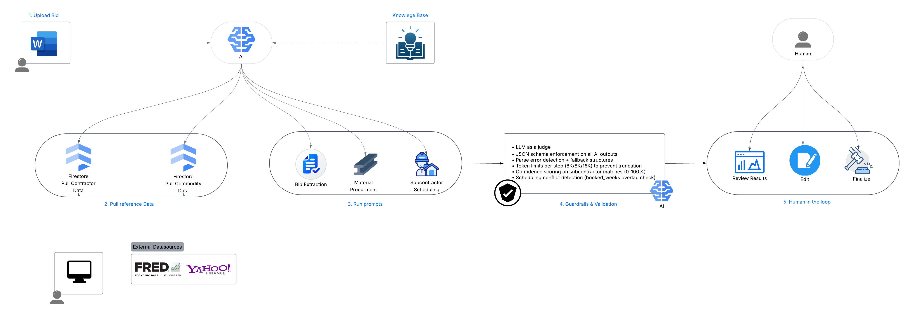

# BidCraft

AI-powered bid management platform for commercial general contractors. BidCraft automates the analysis of construction bid documents, generates cost estimates grounded in live commodity data, matches subcontractors by trade, availability, and scheduling conflicts, and cross-validates all AI outputs using a second model (LLM-as-a-Judge) to catch hallucinations and errors before a human ever reviews the results.

> Built as part of a CIS 568 AI Strategy course project exploring how AI can create competitive advantage for new entrants in the construction technology industry.

## Demo

[](https://youtu.be/d0XW2vyfaE4)

Watch the full demo walkthrough on [YouTube](https://youtu.be/d0XW2vyfaE4). The project presentation is available in [`Presentation.pptx`](Presentation.pptx).

**Live deployment:**
- Frontend: https://bidcraft-frontend-314181730730.us-central1.run.app
- Backend: https://bidcraft-backend-314181730730.us-central1.run.app

## Team

- **Leonard Lwakabamba**
- **Alpha Bah**
- **Julissa Estrada**
- **Andrew Scranton**
- **Chandler White**

## Project Context

BidCraft was developed for a graduate AI Strategy course. The assignment asked teams to pitch an AI-enabled new entrant in an industry where AI is central to competitive advantage.

**The problem:** Commercial general contractors spend days manually reading bid documents, building cost estimates in spreadsheets, and calling subcontractors to check availability. The process is slow, error-prone, and depends heavily on estimator experience.

**The product:** BidCraft is a bid analysis platform that takes a raw bid document (.docx), extracts the scope, generates cost estimates using live commodity prices, matches subcontractors from a database, and validates the entire analysis using a second AI model. The human reviews, edits, and finalizes. AI never auto-submits.

**The industry:** AI-assisted preconstruction estimation tools for commercial general contractors in the U.S. market.

**Why now:** Foundation models (Claude, Llama) can now reliably parse unstructured construction documents and produce structured outputs (JSON with CSI divisions, line-item estimates, schedules). This was not feasible two years ago. Live commodity APIs and cloud-hosted open models (Vertex AI) make it possible to ground and validate AI outputs without building custom ML pipelines.

**The moat:** Subcontractor network data. Every GC that uses BidCraft builds a proprietary database of subcontractor availability, rates, ratings, and booking history. This data compounds over time and creates switching costs. The AI gets better at matching as the database grows.

## Features

### 4-Step AI Analysis Pipeline
Upload `.docx` bid documents and run a multi-step AI analysis:

1. **Bid Extraction** (Claude Sonnet) - Extracts project scope by CSI MasterFormat division, identifies risk flags, generates GC clarification questions, and infers the construction schedule
2. **Material Procurement** (Claude Sonnet) - Generates line-item cost estimates adjusted for live commodity prices, recommends optimal material ordering timing based on 3-month price trends
3. **Subcontractor Scheduling** (Claude Sonnet) - Matches required trades against a subcontractor database, evaluates scheduling conflicts using a 52-week booking model, and ranks matches by availability, quality rating, location, and cost
4. **LLM-as-a-Judge Validation** (Llama 4 Maverick via Vertex AI) - A completely separate model independently reviews all three Claude outputs against the original document, checking for hallucinated scope items, pricing plausibility, schedule consistency, and cross-step contradictions. Returns a 0-100 quality score with specific flagged issues

Steps 2 and 3 run in parallel for faster analysis.

### Guardrails and Validation
- **Cross-model validation** - Llama 4 Maverick catches errors Claude might miss (different model family, different biases)
- **JSON schema enforcement** on all AI outputs with fallback structures
- **Confidence scoring** - Subcontractor matches scored 0-100%, material estimates rated low/medium/high
- **Scheduling conflict detection** - Compares project needs against each sub's booked weeks

### Bid Preparation and Finalization
- Editable tables for schedule, subcontractor assignments, and material orders
- Two-gate human review: AI generates, human reviews, "Submit for Preparation", manual edits, "Finalize"
- Export to PDF and CSV

### Subcontractor Management
- Searchable database with trade, location, rating, and rate information
- 52-week availability timeline showing booked vs. available weeks
- Bulk CSV import/export with scheduling data

### Market Intelligence
- Live commodity prices (Steel, Copper, Diesel, Lumber, Gypsum) via Yahoo Finance and FRED
- Interest rate data from the Federal Reserve
- AI-generated market briefings summarizing trends and bid recommendations

### Prompt Management
- View and customize all AI prompt templates including the judge validation prompt
- Per-prompt model display (Claude Sonnet for analysis, Llama 4 Maverick for validation)
- Version tracking with reset-to-defaults

## Architecture



```
Upload (.docx)
    |
    v
Document Parser --> raw_text + raw_tables
    |
    v
Step 1: Bid Extraction (Claude Sonnet)
    |           |
    v           v
Step 2: Material    Step 3: Subcontractor
Procurement         Scheduling
(Claude Sonnet)     (Claude Sonnet)
  + Yahoo Finance     + Firestore sub DB
  + FRED API          [run in parallel]
    |           |
    v           v
Step 4: Judge Validation (Llama 4 Maverick via Vertex AI)
    |
    v
Human Review --> Edit --> Finalize
```

### Data Sources Per Tab

| Tab | Uploaded Doc | Reference Data | AI Generated |
|-----|-------------|----------------|--------------|
| Scope | Text + tables read by AI | - | Divisions, risks, questions, confidence |
| Schedule | Inferred from scope | - | Activities, durations, dependencies |
| Estimate | - | Commodity prices (Yahoo/FRED) | Line items, unit costs, totals |
| Materials | - | Commodity price trends | Order timing, buy recommendations |
| Subcontractors | - | Sub database (Firestore) | Trade matches, confidence scores, conflict flags |
| Risks & Questions | Text + tables read by AI | - | Risk flags, GC questions, priorities |

## Tech Stack

### Backend
- **Python 3.11** / **FastAPI** / **Uvicorn**
- **Anthropic Claude API** (claude-sonnet-4) - AI analysis engine (Steps 1-3)
- **Meta Llama 4 Maverick** via **Google Vertex AI** - LLM-as-a-Judge validation (Step 4)
- **Google Cloud Firestore** - NoSQL database
- **yfinance** - Commodity price data
- **FRED API** - Interest rate and PPI data
- **python-docx** - Document parsing

### Frontend
- **React 19** / **TypeScript** / **Vite**
- **Tailwind CSS** - Styling
- **TanStack React Query** - Server state management
- **Recharts** - Data visualization
- **jsPDF** - PDF export

### Infrastructure
- **Google Cloud Run** - Production deployment (backend + frontend)
- **Docker** - Container builds
- **Google Artifact Registry** - Container images
- **GCP Secret Manager** - API key storage

## Project Structure

```
bidcraft/
├── docker-compose.yml
├── backend/
│   ├── app/
│   │   ├── main.py                    # FastAPI app
│   │   ├── config.py                  # Environment settings
│   │   ├── db/
│   │   │   ├── firestore_client.py    # Firestore connection
│   │   │   └── seed.py                # Seed data
│   │   ├── prompts/
│   │   │   └── defaults.py            # 5 prompt templates (incl. judge)
│   │   ├── routers/                   # API endpoints
│   │   └── services/
│   │       ├── bid_analyzer.py        # 4-step pipeline orchestrator
│   │       ├── claude_service.py      # Anthropic API wrapper
│   │       ├── vertex_judge_service.py # Llama 4 Maverick via Vertex AI
│   │       ├── commodity_service.py   # Yahoo Finance + FRED
│   │       ├── subcontractor_service.py
│   │       └── document_parser.py
│   ├── requirements.txt
│   └── Dockerfile
└── frontend/
    ├── src/
    │   ├── pages/                     # 7 page components
    │   ├── api/                       # API clients
    │   ├── components/                # Shared UI
    │   └── types/                     # TypeScript interfaces
    ├── package.json
    └── Dockerfile
```

## Getting Started

### Prerequisites
- Python 3.11+
- Node.js 20+
- Google Cloud project with Firestore and Vertex AI enabled
- Anthropic API key
- FRED API key

### Environment Setup

Create `backend/.env`:

```env
ANTHROPIC_API_KEY=sk-ant-...
CLAUDE_MODEL=claude-sonnet-4-20250514
GOOGLE_CLOUD_PROJECT=your-project-id
GOOGLE_APPLICATION_CREDENTIALS=./service-account.json
FRED_API_KEY=your_fred_api_key
CORS_ORIGINS=http://localhost:5173,http://localhost:3000
```

### Run with Docker

```bash
docker-compose up
```

### Run Locally

**Backend:**
```bash
cd backend
pip install -r requirements.txt
python -m uvicorn app.main:app --host 0.0.0.0 --port 8000 --reload
```

**Frontend:**
```bash
cd frontend
npm install
npm run dev
```

### Seed Data

```bash
cd backend
python -m app.db.seed
```

Seeds 5 prompt templates (including judge validation) and sample Arizona-based subcontractors.

### Try It

A sample bid document is included: [`SampleBid_OfficeTI.docx`](SampleBid_OfficeTI.docx). Upload it through the UI and click "Analyze with AI" to see the full pipeline in action.

## API Overview

| Endpoint | Description |
|---|---|
| `POST /api/bids/upload` | Upload a `.docx` bid document |
| `POST /api/bids/{id}/analyze` | Run 4-step AI analysis (incl. judge) |
| `GET /api/bids/{id}` | Get bid with analysis results |
| `PUT /api/bids/{id}/preparation` | Save preparation edits |
| `POST /api/bids/{id}/finalize` | Finalize bid |
| `GET /api/subcontractors` | List all subcontractors |
| `POST /api/subcontractors/upload-csv` | Bulk import from CSV |
| `GET /api/market/commodities` | Live commodity prices + trends |
| `GET /api/market/rates` | Interest rate data |
| `GET /api/market/summary` | AI market briefing |
| `GET /api/prompts` | List all prompt templates |
| `POST /api/prompts/reset` | Reset prompts to defaults |

## AI Tools Disclosure

This project was built with assistance from Claude Code (Anthropic's CLI development tool). Claude Code was used for code generation, debugging, deployment scripting, and documentation. All outputs were reviewed and validated by team members. The application itself uses Claude Sonnet 4 for bid analysis and Meta Llama 4 Maverick (via Google Vertex AI) for cross-model validation.
